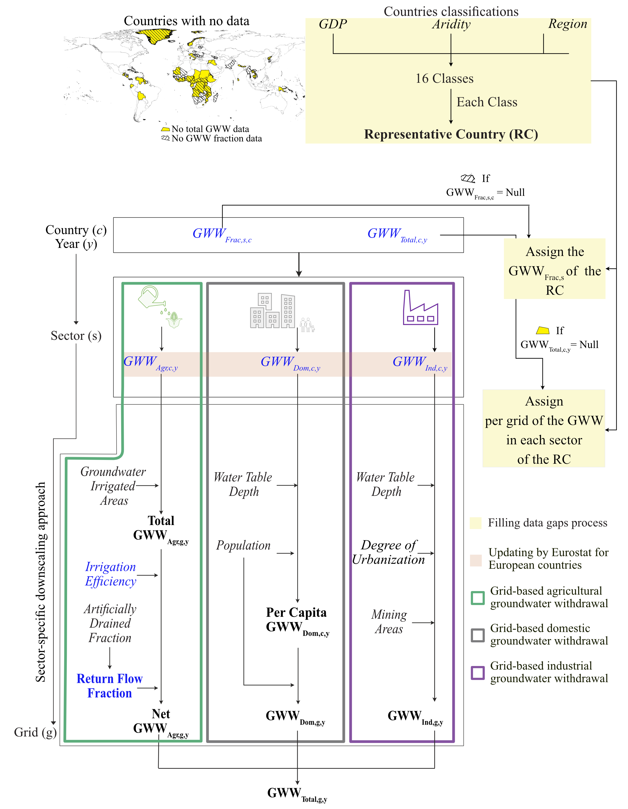
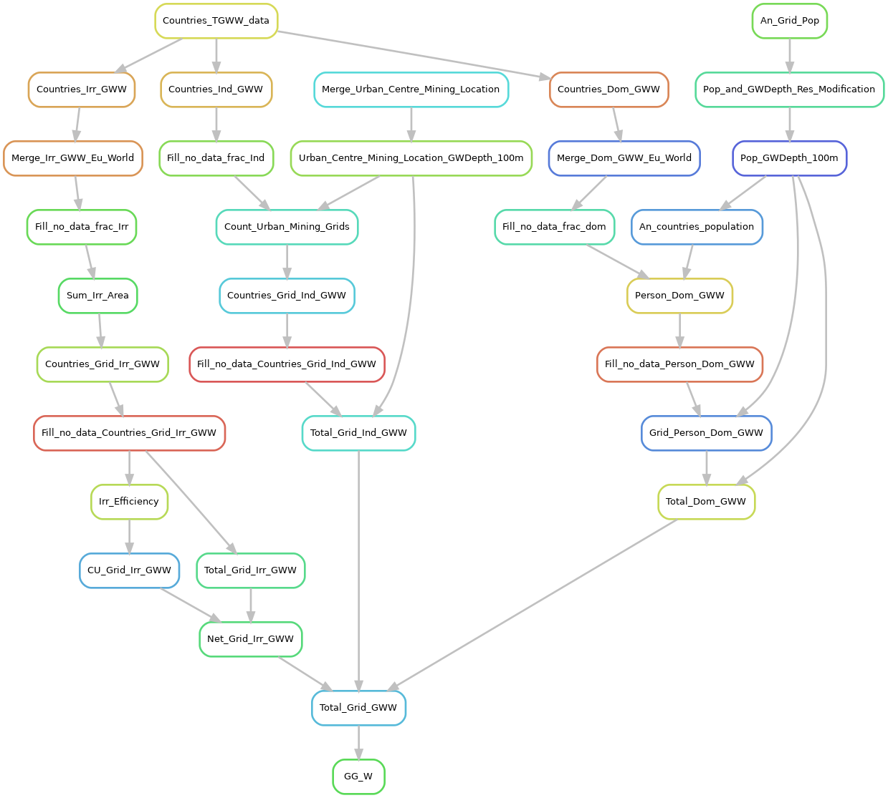

# Project Title

Global Groundwater Withdrawal Model

# Project Description

The newly developed Global Groundwater Withdrawal (GGW) model is a data-driven framework developed to estimate annual groundwater withdrawal (GWW) across three main sectors: domestic, industrial, and agricultural. Implemented in Python, the model operates at a spatial resolution of 0.1° and is used here to estimate annual withdrawal from 2001 to 2020 (refer to Fig. 1).

The default spatial and temporal setup of the model is as follows: spatial resolution of 0.1°×0.1° and annual temporal resolution. The model encompasses a spatial extent ranging from 180.0°W to 180.0°E longitudes and 90.0°N to 90.0°S latitudes, with a temporal range spanning from 2001 to 2020.

Fig. 1. Schematic representation of the data-driven Global Groundwater Withdrawal (GGW) Model. This diagram illustrates the methodology used to estimate annual groundwater withdrawal for domestic (Dom), industrial (Ind), and agricultural (Agr) sectors at the grid level. Country-level data (Annual country groundwater withdrawals (FAO., 2023), and per-sector country fraction of groundwater withdrawal (IGRAC, 2024)) are used and downscaled to 0.1° resolution using sector-specific spatial proxies (e.g., population, irrigated area). The figure also shows country classification and gap-filling techniques. Inputs are presented in italic font, and elements considered in the uncertainty assessment are marked in blue.

## Prerequisite
- [numpy](https://numpy.org/install/)
- [xarray](https://docs.xarray.dev/en/latest/getting-started-guide/installing.html)
- [pandas](https://pandas.pydata.org/docs/getting_started/install.html)
- [geopandas](https://geopandas.org/en/stable/getting_started/install.html)
- [shapely](https://shapely.readthedocs.io/en/stable/installation.html)
- [rasterstats](https://pythonhosted.org/rasterstats/)
- [rasterio](https://rasterio.readthedocs.io/en/stable/)
- [snakemake](https://snakemake.readthedocs.io/en/stable/getting_started/installation.html)

## Getting Started
To run the Global Groundwater Withdrawal (GGW) model, ensure you have prepared the Input_Info.csv file. This file contains the necessary input data sources. All the information about the sources of this inputs or the availability of these inputs in the data folder are mentioned in Input_Info.csv.
To execute the GGW model, you'll need to utilize the Snakemake library in Python. Please consider updating the first line of the Snakefile based on the directory path where you saved GGW model (/src).  The model workflow is orchestrated by the Snakefile, which automates the execution of various tasks.

Additionally, you can visualize the workflow of the GGW model by examining the Snakemake rule graph, as illustrated in Figure. 2. This graph provides insights into the sequence of code execution within the GGW Model.

## Documentation

For more detailed information on the GGW model and to cite the model, please refer to the following article:

Nazari, S., Reinecke, R., Moosdorf, N., 2025. Global estimates of groundwater withdrawal trends and uncertainties. Preprint, (https://doi.org/10.31223/X51F06).

## References to Input Data
- [FAO., 2023. AQUASTAT Core Database. Food and Agriculture Organization of the United Nations.](https://www.fao.org/aquastat/en/databases/maindatabase)
- [IGRAC, 2024. Global Groundwater Information System (GGIS). International Groundwater Resources Assessment Centre (IGRAC), Delft, the Netherlands.](https://un-igrac.org/data/dataset/)
- [Eurostat, 2024. Annual freshwater abstraction by source and sector. In: Eurostat (Ed.). DOI:10.2908/ENV_WAT_ABS.](https://ec.europa.eu/eurostat/databrowser/view/ENV_WAT_ABS/default/table?lang=en)
- [CIESIN, 2018. Gridded Population of the World, Version 4 (GPWv4): Population Density, Revision 11. Center for International Earth Science Information Network - CIESIN - Columbia University, NASA Socioeconomic Data and Applications Center (SEDAC), Palisades, New York. DOI:10.7927/H49C6VHW.](https://www.earthdata.nasa.gov/data/catalog/sedac-ciesin-sedac-gpwv4-popdens-r11-4.11)
- [R. Reinecke, S. Gnann, L. Stein, M. F. Bierkens, I. E. de Graaf, T. Gleeson, et al., 2024. Uncertainty in model estimates of global groundwater depth. Environmental Research Letters. DOI:10.1088/1748-9326/ad8587.](https://iopscience.iop.org/article/10.1088/1748-9326/ad8587)
- [JRC, 2021. Global Human Settlement Layer: Population and Built-Up Estimates, and Degree of Urbanization Settlement Model Grid. Joint Research Centre—JRC—European Commission, NASA Socioeconomic Data and Applications Center (SEDAC), Palisades, NY, USA. DOI:10.7927/h4154f0w.](https://www.earthdata.nasa.gov/data/catalog/sedac-ciesin-sedac-ghsl-pbsmod-1.00)
- [Maus, V. et al., 2020. Global-scale mining polygons (Version 1), PANGAEA. DOI:10.1594/PANGAEA.910894.](https://doi.pangaea.de/10.1594/PANGAEA.910894)
- [Siebert, S., Henrich, V., Frenken, K., Burke, J., 2013. Global Map of Irrigation Areas version 5. Rheinische Friedrich-Wilhelms-University, Bonn, Germany / Food and Agriculture Organization of the United Nations, Rome, Italy.](https://www.fao.org/aquastat/en/geospatial-information/global-maps-irrigated-areas/latest-version)
- [Rohwer, J., Gerten, D., and Lucht, W. (2007). Development of Functional Types of Irrigation for Improved Global Crop Modelling, PIK Rep. 104, Potsdam Institute for Climate Impact Research, Potsdam, Germany.](https://publications.pik-potsdam.de/pubman/faces/ViewItemOverviewPage.jsp?itemId=item_14687)
- [Feick, S., Siebert, S., Döll, P., 2005. A digital global map of artificially drained agricultural areas.](https://www.uni-frankfurt.de/45218077/Global_map_of_artificially_drained_agricultural_areas)

